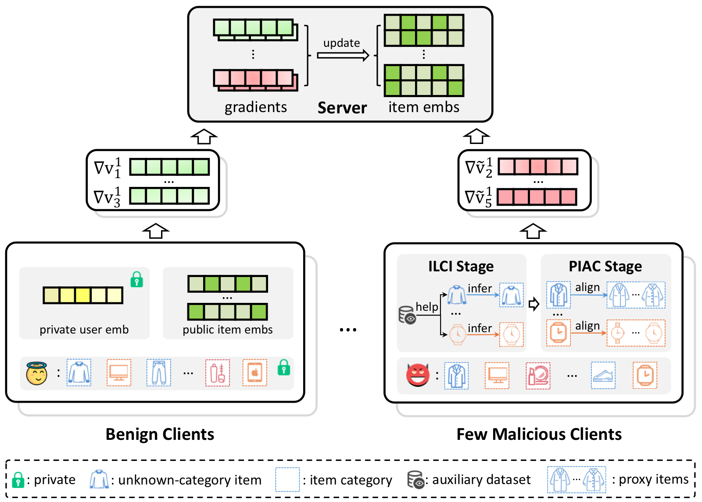
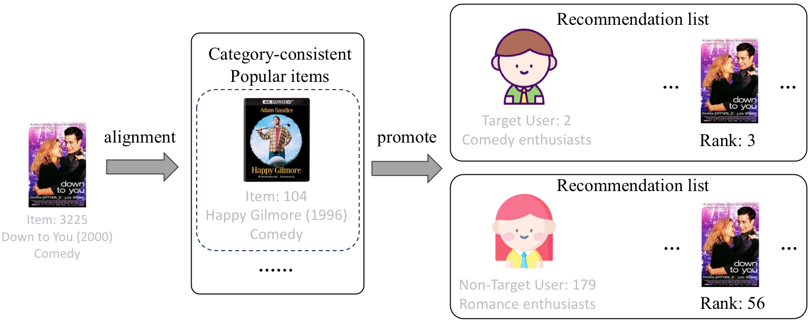

# ProitTUA

Official implementation of **ProitTUA**, the paper titled **"Target User Attack on Federated Recommender Systems with Proxy Items and Its Countermeasure"**, published in **ACM Transactions on Information Systems (TOIS)**.

This repository contains the runnable code, processed data files, target-user file, framework figure, and a case-study PDF for reproducing the default ProitTUA experiment.

## Overview

ProitTUA studies targeted user attacks in federated recommendation. The goal is to promote a small set of target items to a specified group of target users while limiting unintended exposure to non-target users. To achieve this, ProitTUA uses an auxiliary-domain modeling module to infer category-aware popular items, and then constructs malicious gradients that continuously push target items toward the preference region of the selected target-user group during federated training. This release also includes the proposed gradient-dynamics-based defense mechanism, which detects suspicious item-gradient fluctuations, traces dominant clients, and excludes suspicious clients from aggregation.

### Framework



### Case Study



The source files are also available as [framework.pdf](framework.pdf) and [case-study.pdf](case-study.pdf).

## Repository Structure

```text
.
├── main.py                    # Main entry point
├── parse.py                   # Experiment and attack hyperparameters
├── data.py                    # Data loading utilities
├── client.py                  # Federated recommendation client
├── server.py                  # Federated recommendation server and evaluation
├── attack.py                  # Malicious client and attack gradient construction
├── auxiliary_miner.py          # Auxiliary-domain popular-item mining module
├── evaluate.py                # HR, NDCG, MRR, and target attack evaluation
├── target_user.json           # Target users used by the default experiment
├── Data/
│   ├── ML-1M/                 # Attack-domain data
│   └── ML-Au/                 # Auxiliary-domain data
├── framework.pdf
├── case-study.pdf
└── assets/                    # Images displayed in README
```

## Environment

The code is implemented with Python and PyTorch. The paper experiments were implemented using PyTorch 1.8.1 + CUDA 11. The current code also runs with newer PyTorch versions in our local environment.

Install the basic dependencies with:

```bash
pip install -r requirements.txt
```

## Quick Start

Run the default ML-1M experiment:

```bash
python main.py
```

By default, the script uses CPU. To run on GPU, pass a CUDA device explicitly:

```bash
python main.py --device cuda
```

Run ProitTUA with the proposed defense mechanism:

```bash
python main.py --defense_strategy GradientDynamics
```

The training logs are written to different files according to the experiment mode:

```text
Result/ML-1M_Attack.txt          # Attack only
Result/ML-1M_Attack_Defense.txt  # Attack with defense
```

Each iteration reports recommendation metrics and attack metrics:

```text
Iteration, loss, test-hr, test-ndcg, test-mrr, AP, TCR, AER, ACR, target_user_rank, non_target_user_rank
```

## Default Configuration

The default configuration in `parse.py` follows the released ProitTUA setting:

- Backbone: `NCF`
- Dataset: `ML-1M`
- Auxiliary domain: `ML-Au`
- Embedding dimension: `32`
- Global communication epochs: `20`
- Attack launch epoch: `8`
- Malicious client ratio: `0.5%`
- Target items: `[3225, 3536, 3435, 3533]`
- Target item category: `4`
- Target users: `target_user.json`
- Number of mined popular items per category: `4`
- Attack strength: `attack_popular_factor=2.25`, `attack_grad_scale=6.0`, `attack_decay_ratio=0.4` for decaying `attack_grad_scale`
- Defense strategy: `NoDefense` by default

You can override these parameters from the command line. For example:

```bash
python main.py --device cuda --epochs 20 --clients_limit 0.005
```

## Data Format

Each line in `train.dat` and `test.dat` stores one user followed by the interacted item ids:

```text
user_id item_id item_id item_id ...
```

Item-category mapping files are stored in `mapped_item_categories.txt`, and category id mappings are stored in `category_mapping.txt`.

## Notes

- `target_user.json` is the target-user set used by the released default experiment.
- Runtime outputs under `Result/` are ignored by Git and can be regenerated by running `main.py`.


## Citation

If you use this repository, please cite the ProitTUA paper. The BibTeX entry will be updated after the final publication metadata is available.
